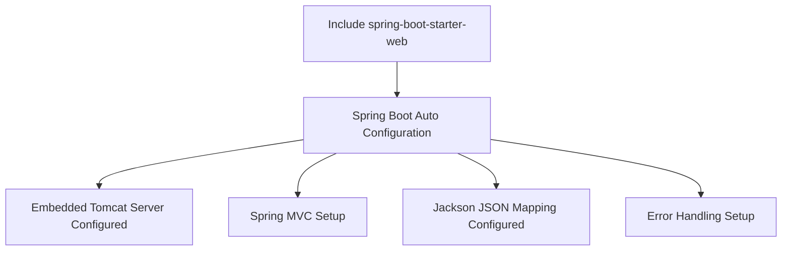
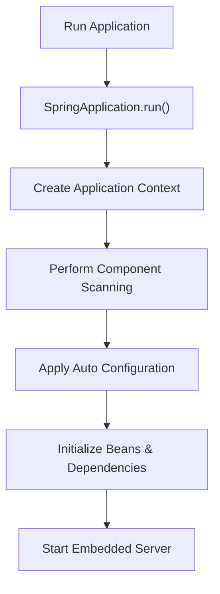

# 🚀 Spring Boot Starter & Auto Configuration

---

## 🏷️ Understanding Spring Boot Starters

**Spring Boot Starters** are a set of convenient dependency descriptors you can include in your project. They bring in a set of pre-defined dependencies to simplify configuration and reduce boilerplate.

### 🔹 Example:

```xml
<dependency>
    <groupId>org.springframework.boot</groupId>
    <artifactId>spring-boot-starter-web</artifactId>
</dependency>
```

**spring-boot-starter-web** includes:

* Spring MVC
* Embedded Tomcat server
* Jackson for JSON parsing
* Validation support

**Benefits:**

* Quick project setup
* Reduced manual dependency management
* Consistent version management

---

## 🏷️ Understanding Auto-Configuration

**Auto-Configuration** is a feature of Spring Boot that automatically configures your Spring application based on the dependencies present on the classpath.

### 🔹 How it works:

* Spring Boot uses `@EnableAutoConfiguration` annotation.
* It scans classpath and applies relevant configurations.

---

## 🏷️ How spring-boot-starter-web Auto-Configures

When you add `spring-boot-starter-web`:

1. **Embedded Server Setup:** Spring Boot configures an embedded Tomcat server by default.
2. **Spring MVC Configuration:** Configures request mapping, view resolvers, message converters.
3. **JSON Support:** Auto-configures Jackson for JSON serialization/deserialization.
4. **Error Handling:** Auto-configures `BasicErrorController` for default error pages.

### 🏷️ Example Flow:



---

# 🚀 `@SpringBootApplication` Annotation

---

The `@SpringBootApplication` annotation is the **entry point of any Spring Boot application**. It tells Spring Boot to start scanning, auto-configuring, and initializing your project.

---

## 🏷️ What is `@SpringBootApplication`?

This single annotation is a combination of three core annotations:

1. **`@Configuration`** → Marks the class as a source of bean definitions.
2. **`@EnableAutoConfiguration`** → Enables Spring Boot’s auto-configuration mechanism that automatically configures beans based on the classpath dependencies.
3. **`@ComponentScan`** → Tells Spring to scan the package (and its subpackages) for components like `@Component`, `@Service`, `@Repository`, and `@Controller`.

So, the following three annotations:

```java
@Configuration
@EnableAutoConfiguration
@ComponentScan
```

can be replaced by just one:

```java
@SpringBootApplication
```

---

## 🏷️ Program: Spring Boot Main Class

```java
import org.springframework.boot.SpringApplication;
import org.springframework.boot.autoconfigure.SpringBootApplication;

@SpringBootApplication
public class SpringBootCourseApplication {

    public static void main(String[] args) {
        SpringApplication.run(SpringBootCourseApplication.class, args);
    }
}
```

**Explanation:**

* `SpringApplication.run()` starts the embedded Spring container.
* It sets up the application context, scans for components, and applies auto-configuration.
* The embedded server (like Tomcat) is started automatically.

### 🔹 How It Works Internally



### 🔹 Example Output on Run

When you run the application, you’ll typically see:

```
  .   ____          _            __ _ _
 /\\ / ___'_ __ _ _(_)_ __  __ _ \ \ \ \
( ( )\___ | '_ | '_| | '_ \/ _` | \ \ \ \
 \\/  ___)| |_)| | | | | || (_| |  ) ) ) )
  '  |____| .__|_| |_|_| |_\__, | / / / /
 =========|_|==============|___/=/_/_/_/
 :: Spring Boot ::  (v3.2.0)
```

This indicates that your Spring Boot application has started successfully!

---

## 📌 Key Notes

* Eliminates the need for XML-based configuration.
* Simplifies setup with sensible defaults.
* Automatically starts the embedded web server.
* Reduces boilerplate code by combining three key annotations.

---

## ✨ Summary

| Concept         | Description                                                    |
| --------------- | -------------------------------------------------------------- |
| **Annotation**  | `@SpringBootApplication`                                       |
| **Combines**    | `@Configuration`, `@EnableAutoConfiguration`, `@ComponentScan` |
| **Purpose**     | Marks the main class and starts the Spring Boot app            |
| **Entry Point** | `SpringApplication.run()`                                      |

---
