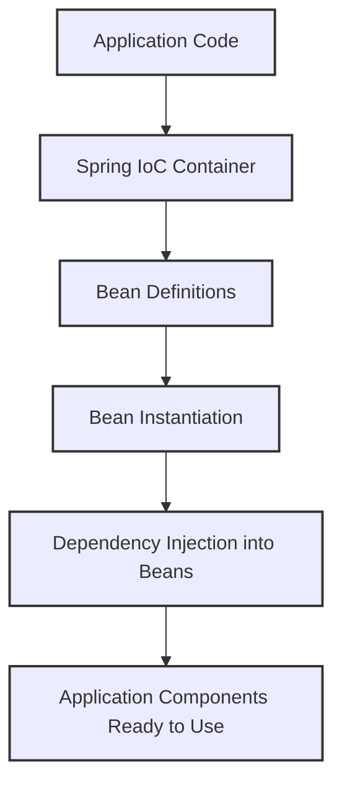

# 🚀 Dependency Injection & Spring Core

---

## 🏷️ What is Dependency Injection (DI)?

Dependency Injection is a design pattern where the dependencies of a class are provided externally rather than the class creating them itself.  
This promotes loose coupling, reusability, and testability.

**Example without DI:**

```java
class Engine {}
class Car {
    private Engine engine = new Engine();
}
```

**Example with DI:**

```java
class Engine {}
class Car {
    private Engine engine;

    public Car(Engine engine) {
        this.engine = engine;
    }
}
```

---

## 🏷️ Tight Coupling vs Loose Coupling

### Tight Coupling
- Occurs when a class is dependent on the concrete implementation of another class.
- Reduces flexibility and testability.

**Example:**
```java
class Engine {}
class Car {
private Engine engine = new Engine(); // tightly coupled
}
```

### Loose Coupling
- Occurs when a class depends on abstractions (interfaces) rather than concrete implementations.
- Changes in one class have minimal impact on dependent classes.
- Improves flexibility and makes unit testing easier.

**Example:**
```java
interface Engine {}
class DieselEngine implements Engine {}
class Car {
private Engine engine;


public Car(Engine engine) {
this.engine = engine; // loosely coupled
}
}
```

**Benefit:** DI is a key way to achieve loose coupling by allowing the framework to inject dependencies.

---

## 🏷️ What is Inversion of Control (IoC)?

- Inversion of Control is a principle where the control of object creation and lifecycle management is transferred from the application code to a framework or container.
- Spring Core provides the IoC container that manages the lifecycle and configuration of application objects (beans).  
- This container injects dependencies automatically, reducing boilerplate and simplifying development.  

**Analogy:**
Instead of making your own coffee machine (creating dependencies), you get coffee prepared by a barista (IoC container).

---

## 🏷️ Key Annotations in Spring

### 🔹 `@Component`

Marks a class as a Spring-managed component. Enables automatic detection via classpath scanning.

```java
@Component
public class Engine {}
```

### 🔹 `@Service`

Specialized form of @Component, used for service layer classes.

```java
@Service
public class CarService {}
```

### 🔹 `@Repository`

Specialized form of @Component, used for DAO layer classes. Provides automatic translation of database exceptions.

```java
@Repository
public class CarRepository {}
```

### 🔹 `@Autowired`

Enables automatic dependency injection by type. Can be applied to fields, setters, or constructors.

```java
@Component
public class Car {

    @Autowired
    private Engine engine;

    public void start() {
        System.out.println("Car started with engine: " + engine);
    }
}
```

---

## 🏷️ How does DI and IoC works together?

1. Define beans using @Component, @Service, or @Repository.
2. Enable component scanning with @ComponentScan.
3. Inject beans using @Autowired.



**Example Spring Boot Application:**

```java
@SpringBootApplication
@ComponentScan("com.example")
public class DemoApplication {
    public static void main(String[] args) {
        SpringApplication.run(DemoApplication.class, args);
    }
}
```

**Bean Injection Example:**

> ✅ `Note:` For working sample refer [here](../src/main/java/com/vednexgen/vehicle)

**Model:**

```java
import lombok.AllArgsConstructor;
import lombok.Getter;
import lombok.Setter;

@Setter
@Getter
@AllArgsConstructor
public class Car {

    String name;
    String model;
    String color;

}
```

**Controller:** 

```java
import com.vednexgen.vehicle.model.Car;
import com.vednexgen.vehicle.service.CarService;
import org.springframework.beans.factory.annotation.Autowired;
import org.springframework.web.bind.annotation.GetMapping;
import org.springframework.web.bind.annotation.RequestMapping;
import org.springframework.web.bind.annotation.RestController;

import java.util.List;

@RequestMapping("/cars")
@RestController
public class CarController {

    @Autowired
    CarService carService;

    public CarController(CarService carService) {
        this.carService = carService;
    }

    @GetMapping
    public List<Car> getCars() {
        return carService.gatCars();
    }
}
```

**Service:**

```java
import com.vednexgen.vehicle.model.Car;
import org.springframework.stereotype.Service;

import java.util.ArrayList;
import java.util.List;

@Service
public class CarService {

    List<Car> cars = new ArrayList<>();

    public CarService() {
        cars.add(new Car("Maruti", "Desire", "Red"));
        cars.add(new Car("Kia", "Sonet", "Black"));
    }

    public List<Car> gatCars() {
        return cars;
    }
}
```

---

## 🏷️ Benefits of DI & IoC

* Loose coupling
* Better testability
* Reusability
* Centralized configuration and lifecycle management

---

## ✨ Summary

* DI: Externalizing dependency creation.
* IoC: Framework manages object lifecycle.
* Spring Core: Provides IoC container & DI support.
* Key Annotations: @Component, @Service, @Repository, @Autowired.

---
