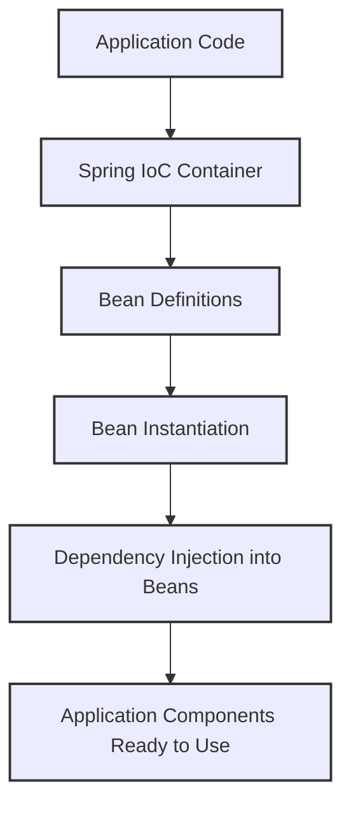
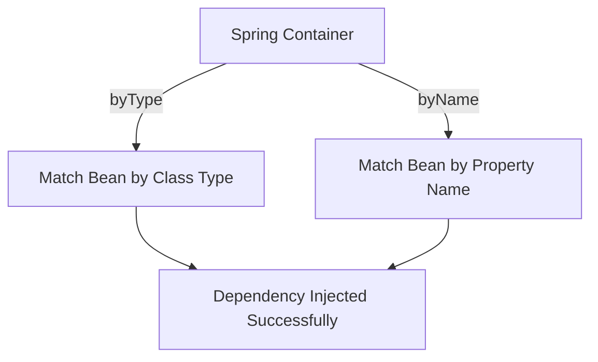

# 🚀 Dependency Injection, It's Type and Autowiring Modes

---

## 🏷️ What is Dependency Injection (DI)?

Dependency Injection is a design pattern where the dependencies of a class are provided externally rather than the class creating them itself.  
This promotes loose coupling, reusability, and testability.

**Example without DI:**

```java
class Engine {}
class Car {
    private Engine engine = new Engine();
}
```

**Example with DI:**

```java
class Engine {}
class Car {
    private Engine engine;

    public Car(Engine engine) {
        this.engine = engine;
    }
}
```

---

## 🏷️ Tight Coupling vs Loose Coupling

### Tight Coupling
- Occurs when a class is dependent on the concrete implementation of another class.
- Reduces flexibility and testability.

**Example:**
```java
class Engine {}
class Car {
private Engine engine = new Engine(); // tightly coupled
}
```

### Loose Coupling
- Occurs when a class depends on abstractions (interfaces) rather than concrete implementations.
- Changes in one class have minimal impact on dependent classes.
- Improves flexibility and makes unit testing easier.

**Example:**
```java
interface Engine {}
class DieselEngine implements Engine {}
class Car {
private Engine engine;


public Car(Engine engine) {
this.engine = engine; // loosely coupled
}
}
```

**Benefit:** DI is a key way to achieve loose coupling by allowing the framework to inject dependencies.

---

## 🏷️ What is Inversion of Control (IoC)?

- Inversion of Control is a principle where the control of object creation and lifecycle management is transferred from the application code to a framework or container.
- Spring Core provides the IoC container that manages the lifecycle and configuration of application objects (beans).  
- This container injects dependencies automatically, reducing boilerplate and simplifying development.  

**Analogy:**
Instead of making your own coffee machine (creating dependencies), you get coffee prepared by a barista (IoC container).

---

## 🏷️ Key Annotations in Spring

### 🔹 `@Component`

Marks a class as a Spring-managed component. Enables automatic detection via classpath scanning.

```java
@Component
public class Engine {}
```

### 🔹 `@Service`

Specialized form of @Component, used for service layer classes.

```java
@Service
public class CarService {}
```

### 🔹 `@Repository`

Specialized form of @Component, used for DAO layer classes. Provides automatic translation of database exceptions.

```java
@Repository
public class CarRepository {}
```

### 🔹 `@Autowired`

Enables automatic dependency injection by type. Can be applied to fields, setters, or constructors.

```java
@Component
public class Car {

    @Autowired
    private Engine engine;

    public void start() {
        IO.println("Car started with engine: " + engine);
    }
}
```

---

## 🏷️ How does DI and IoC works together?

1. Define beans using @Component, @Service, or @Repository.
2. Enable component scanning with @ComponentScan.
3. Inject beans using @Autowired.



**Example Spring Boot Application:**

```java
@SpringBootApplication
@ComponentScan("com.example")
public class DemoApplication {
    public static void main(String[] args) {
        SpringApplication.run(DemoApplication.class, args);
    }
}
```

**Bean Injection Example:**

> ✅ `Note:` For working sample refer [here](../src/main/java/com/vednexgen/vehicle)

**Model:**

```java
import lombok.AllArgsConstructor;
import lombok.Getter;
import lombok.Setter;

@Setter
@Getter
@AllArgsConstructor
public class Car {

    String name;
    String model;
    String color;

}
```

**Controller:** 

```java
import com.vednexgen.vehicle.model.Car;
import com.vednexgen.vehicle.service.CarService;
import org.springframework.beans.factory.annotation.Autowired;
import org.springframework.web.bind.annotation.GetMapping;
import org.springframework.web.bind.annotation.RequestMapping;
import org.springframework.web.bind.annotation.RestController;

import java.util.List;

@RequestMapping("/cars")
@RestController
public class CarController {

    @Autowired
    CarService carService;

    public CarController(CarService carService) {
        this.carService = carService;
    }

    @GetMapping
    public List<Car> getCars() {
        return carService.gatCars();
    }
}
```

**Service:**

```java
import com.vednexgen.vehicle.model.Car;
import org.springframework.stereotype.Service;

import java.util.ArrayList;
import java.util.List;

@Service
public class CarService {

    List<Car> cars = new ArrayList<>();

    public CarService() {
        cars.add(new Car("Maruti", "Desire", "Red"));
        cars.add(new Car("Kia", "Sonet", "Black"));
    }

    public List<Car> gatCars() {
        return cars;
    }
}
```
---

## 🏷️ `@Qualifier` Annotation

When multiple beans of the same type exist, `@Qualifier` helps Spring identify which bean to inject.

**Example:**

```java
@Component("petrolEngine")
public class PetrolEngine implements Engine {
    public void start() {
        IO.println("Petrol Engine started");
    }
}

@Component("dieselEngine")
public class DieselEngine implements Engine {
    public void start() {
        IO.println("Diesel Engine started");
    }
}

@Service
public class CarService {

    private final Engine engine;

    @Autowired
    public CarService(@Qualifier("dieselEngine") Engine engine) {
        this.engine = engine;
    }

    public void startCar() {
        engine.start();
    }
}
```

**Explanation:**

* Both `PetrolEngine` and `DieselEngine` implement the `Engine` interface.
* Spring gets confused about which bean to inject.
* `@Qualifier` explicitly tells Spring which bean to use.

---

## 🏷️ Benefits of DI & IoC

* Loose coupling
* Better testability
* Reusability
* Centralized configuration and lifecycle management

---

## ✨ Summary

* DI: Externalizing dependency creation.
* IoC: Framework manages object lifecycle.
* Spring Core: Provides IoC container & DI support.
* Key Annotations: @Component, @Service, @Repository, @Autowired.

---

# 🚀 Types of Dependency Injection in Spring

---

## 🏷️ Constructor Injection

Dependencies are provided through the class constructor. This is the **recommended approach** in Spring because it ensures that dependencies are available when the object is created, promoting immutability and easier testing.

### 🧩 Example:

```java
@Component
public class Engine {
    public void start() {
        IO.println("Engine started...");
    }
}

@Component
public class Car {
    private final Engine engine;

    @Autowired
    public Car(Engine engine) {   // Constructor Injection
        this.engine = engine;
    }

    public void drive() {
        engine.start();
        IO.println("Car is running...");
    }
}
```

**✅ Advantages:**

* Promotes immutability (final fields)
* Makes unit testing easier
* Avoids `NullPointerException`

**⚠️ Disadvantage:**

* Can become verbose if there are many dependencies

---

## 🏷️ Setter Injection

Dependencies are provided through setter methods after the object is constructed.

### 🧩 Example:

```java
@Component
public class Car {
    private Engine engine;

    @Autowired
    public void setEngine(Engine engine) {   // Setter Injection
        this.engine = engine;
    }

    public void drive() {
        engine.start();
        IO.println("Car is running...");
    }
}
```

**✅ Advantages:**

* Allows re-injection of dependencies
* Good for optional dependencies

**⚠️ Disadvantage:**

* Object can be in an invalid state if dependency isn’t set before use

---

## 🏷️ Field Injection

Dependencies are injected directly into class fields using `@Autowired`.

### 🧩 Example:

```java
@Component
public class Car {
    @Autowired
    private Engine engine;  // Field Injection

    public void drive() {
        engine.start();
        IO.println("Car is running...");
    }
}
```

**✅ Advantages:**

* Simplifies code (less boilerplate)

**⚠️ Disadvantages:**

* Harder to test (no control over dependency initialization)
* Violates immutability principles

---

## 📌 Best Practice:

> Prefer **Constructor Injection** for mandatory dependencies and **Setter Injection** for optional ones.

---


## ✨ Summary Table

| Type                  | How Dependencies Are Injected | Example                     | Advantages              | Disadvantages              |
| --------------------- | ----------------------------- | --------------------------- | ----------------------- | -------------------------- |
| Constructor Injection | Through class constructor     | `@Autowired` on constructor | Immutable, Testable     | Verbose with many deps     |
| Setter Injection      | Through setter method         | `@Autowired` on setter      | Flexible, Optional deps | Risk of null dependencies  |
| Field Injection       | Directly on field             | `@Autowired` on field       | Simple                  | Hard to test, less control |

---

# 🚀 Autowiring Modes in Spring Dependency Injection

---

## 📚 What is Autowiring?

Autowiring is the process by which Spring automatically resolves and injects collaborating beans (dependencies) into a class without the need for explicit configuration.

Spring identifies dependencies either **by type**, **by name**, or **via constructor arguments**.

---

## 🏷️ Different Autowiring Modes

| Mode                          | Description                                                                               | Example                    | Annotation Equivalent                   |
| ----------------------------- | ----------------------------------------------------------------------------------------- | -------------------------- | --------------------------------------- |
| **no** (default)              | No autowiring. Dependencies must be explicitly defined using configuration (XML or Java). | Manual wiring              | None                                    |
| **byName**                    | Spring injects a bean whose name matches the name of the property.                        | Match by bean name         | `@Autowired` + `@Qualifier("beanName")` |
| **byType**                    | Spring injects a bean whose type matches the property type.                               | Match by class type        | `@Autowired` (default behavior)         |
| **autodetect** *(deprecated)* | Spring automatically chooses between `constructor` or `byType`.                           | Deprecated                 | None                                    |

---

### 🔹 Autowiring by Type (Default)

Spring injects dependencies by matching the **type** of the bean.

```java
@Component
public class Engine {
    public void start() {
        IO.println("Engine started...");
    }
}

@Component
public class Car {
    @Autowired  // byType
    private Engine engine;

    public void drive() {
        engine.start();
        IO.println("Car is running...");
    }
}
```

**Explanation:**
Spring looks for a bean of type `Engine` and injects it automatically.

---

### 🔹 Autowiring by Name

Spring injects dependencies by matching the **property name** with the bean name.

```java
@Component("dieselEngine")
public class Engine {
    public void start() {
        IO.println("Diesel Engine started...");
    }
}

@Component
public class Car {
    @Autowired
    @Qualifier("dieselEngine") // byName
    private Engine engine;

    public void drive() {
        engine.start();
        IO.println("Car is running...");
    }
}
```

**Explanation:**
The `@Qualifier` annotation tells Spring which specific bean to inject if multiple beans of the same type exist.

---

## ✨ Summary

| Autowiring Mode | Matching Type      | Modern Annotation Equivalent | Use Case                               |
| --------------- | ------------------ | ---------------------------- | -------------------------------------- |
| byType          | Bean type          | `@Autowired`                 | Default and most common                |
| byName          | Bean name          | `@Qualifier`                 | When multiple beans of same type exist |

---

### 📌 Key Notes

✅ Prefer **constructor-based autowiring** for required dependencies.
✅ Use **@Qualifier** when multiple beans of the same type exist.
✅ Avoid **field injection** in favor of constructor injection for better testability.

---


---

<div>

[](06-REST_API_ANNOTATIONS.md)
&emsp;&emsp;
[](08-CONFIGURATION_FILES.md)

</div>

[](00-TABLE_CONTENT_README.md)

---
