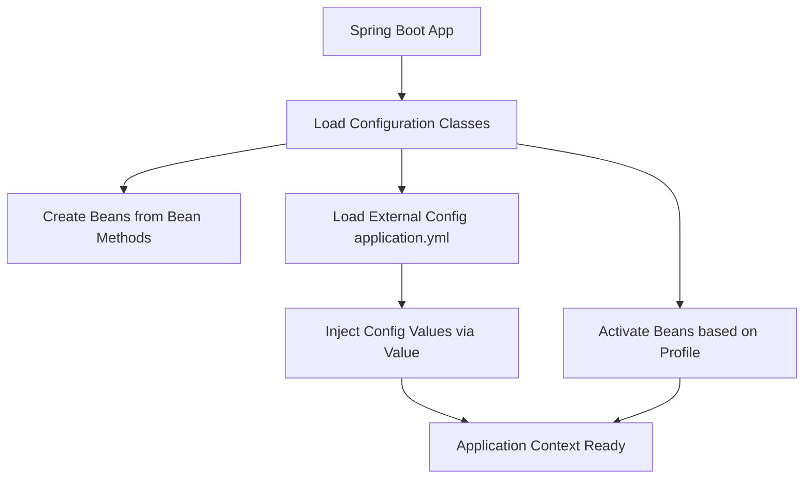

# ⚙️ Spring Configuration

---

## 🏷️ Introduction

Spring Configuration defines how beans are created, initialized, and managed within the Spring Container. It helps you separate **application logic** from **configuration logic**, enabling flexibility and easier environment management.

There are multiple ways to configure Spring applications:

1. **Java-based configuration** (`@Configuration`, `@Bean`)
2. **Annotation-based configuration** (`@Component`, `@Service`, etc.)
3. **External configuration files** (`application.yml` or `application.properties`)
4. **Profiles** (`@Profile` for environment-specific beans)

---

## 🏷️ Java-Based Configuration using `@Configuration` and `@Bean`

### 🔹 `@Configuration`

Indicates that a class declares one or more `@Bean` methods and may be processed by the Spring container to generate bean definitions.

### 🔹 `@Bean`

Marks a method as a bean producer — the method’s return value is registered as a bean in the Spring context.

### 🧩 Example:

```java
@Configuration
public class AppConfig {

    @Bean
    public Engine engine() {
        return new Engine();
    }

    @Bean
    public Car car() {
        return new Car(engine());
    }
}

public class Engine {
    public void start() {
        IO.println("Engine started!");
    }
}

public class Car {
    private final Engine engine;

    public Car(Engine engine) {
        this.engine = engine;
    }

    public void drive() {
        engine.start();
        IO.println("Car is running!");
    }
}
```

---

## 🏷️ External Configuration: `application.yml`

Spring Boot allows configuration values to be externalized using **YAML** or **Properties** files. These are automatically loaded from the `src/main/resources` folder.

### 🧩 Example: `application.yml`

```yaml
spring:
  datasource:
    url: jdbc:h2:mem:testdb
    driver-class-name: org.h2.Driver
    username: sa
    password:
  jpa:
    hibernate:
      ddl-auto: update
    show-sql: true
server:
  port: 8080
```

**Benefits:**

* Centralized configuration
* Easy environment-specific setup
* No need for hard-coded values

---

## 🏷️ Using `@Value` for Property Injection

The `@Value` annotation is used to inject values from configuration files into Spring-managed beans.

```java
@Component
public class DatabaseConfig {

    @Value("${spring.datasource.url}")
    private String dbUrl;

    public void printUrl() {
        IO.println("Database URL: " + dbUrl);
    }
}
```

---

## 🏷️ Environment-Specific Configuration with Profiles

The `@Profile` annotation allows you to define beans that are active only in specific environments like **dev**, **test**, or **prod**.

### 🧩 Example:

```java
@Configuration
@Profile("dev")
public class DevConfig {

    @Bean
    public DataSource devDataSource() {
        IO.println("Using DEV database");
        return new HikariDataSource();
    }
}

@Configuration
@Profile("prod")
public class ProdConfig {

    @Bean
    public DataSource prodDataSource() {
        IO.println("Using PROD database");
        return new HikariDataSource();
    }
}
```

### 🏷️ Activate Profile

In `application.yml`:

```yaml
spring:
  profiles:
    active: dev
```

Or via command line:

```bash
java -jar app.jar --spring.profiles.active=prod
```

---

## ✨ Summary Table

| Concept            | Annotation/File           | Purpose                             |
| ------------------ | ------------------------- | ----------------------------------- |
| Java Config        | `@Configuration`, `@Bean` | Define beans programmatically       |
| External Config    | `application.yml`         | Centralize and externalize settings |
| Property Injection | `@Value`                  | Inject values from config files     |
| Profiles           | `@Profile`                | Environment-based bean activation   |

### 🔄 Flow Diagram


