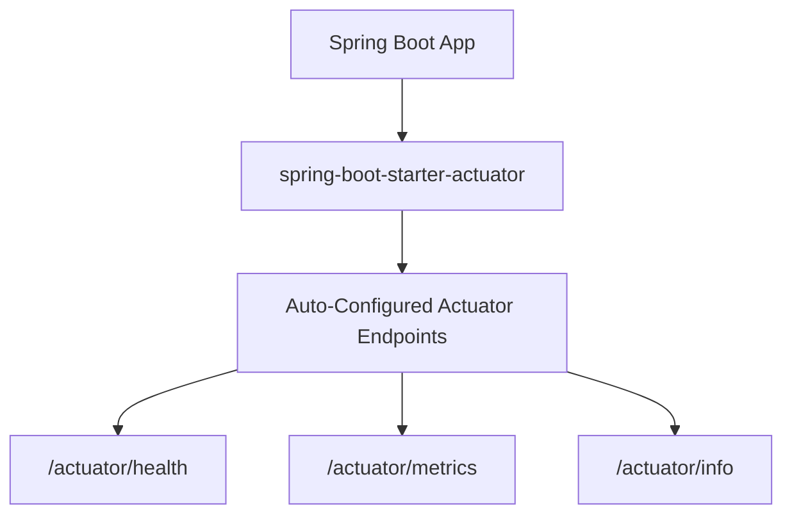

# 🚀 Spring Boot Actuator & Monitoring

---

## 🏷️ What is Spring Boot Actuator?

Spring Boot Actuator provides **production-ready monitoring and management** features to help you observe the internal state of your application.

It exposes a set of **REST endpoints** that give insights into:

* Application health
* Metrics (CPU, memory, threads, etc.)
* Environment properties
* HTTP trace, mappings, and more

---

## 🏷️ Why Use Actuator?

| Feature                | Description                                                |
| ---------------------- | ---------------------------------------------------------- |
| **Health Monitoring**  | Check if your app and its dependencies are running.        |
| **Metrics**            | Get runtime statistics (JVM, memory, threads, etc.).       |
| **Auditing & Tracing** | Capture and monitor events.                                |
| **Integration Ready**  | Works seamlessly with Prometheus, Grafana, New Relic, etc. |

---

## 🏷️ Adding Actuator Dependency

Add the following in your `pom.xml`:

```xml
<dependency>
    <groupId>org.springframework.boot</groupId>
    <artifactId>spring-boot-starter-actuator</artifactId>
</dependency>
```

---

## 🏷️ Configuring Actuator Endpoints (application.yml)

```yaml
management:
  endpoints:
    web:
      exposure:
        include: health, info, metrics
  endpoint:
    health:
      show-details: always
```

**Explanation:**

* `exposure.include` → Defines which endpoints are publicly exposed via HTTP.
* `show-details: always` → Shows full health details instead of just `"status": "UP"`.

---

## 🏷️ Common Actuator Endpoints

| Endpoint             | Description                                                |
| -------------------- | ---------------------------------------------------------- |
| `/actuator/health`   | Health status of the app and dependencies.                 |
| `/actuator/info`     | Custom application info (can be set in `application.yml`). |
| `/actuator/metrics`  | Displays metrics data.                                     |
| `/actuator/beans`    | Shows all Spring beans.                                    |
| `/actuator/mappings` | Shows request-to-handler mappings.                         |

---

## 🏷️Example — Health and Metrics

**Step 1:** Add actuator dependency.
**Step 2:** Configure endpoints in `application.yml`.
**Step 3:** Run the Spring Boot app.

Then visit:

* 🔹 [http://localhost:8080/actuator/health](http://localhost:8080/actuator/health)
* 🔹 [http://localhost:8080/actuator/metrics](http://localhost:8080/actuator/metrics)

**Sample Output (Health Endpoint):**

```json
{
  "status": "UP",
  "components": {
    "db": {
      "status": "UP",
      "details": {
        "database": "H2",
        "validationQuery": "isValid()"
      }
    },
    "diskSpace": {
      "status": "UP",
      "details": {
        "total": 500000000000,
        "free": 450000000000
      }
    }
  }
}
```

---

## 🏷️ Custom Health Indicator Example

> ✅ `Note:` For working sample refer [here](../src/main/java/com/vednexgen/actuator)

You can create your own health indicator by implementing the `HealthIndicator` interface.

```java
import org.springframework.boot.actuate.health.Health;
import org.springframework.boot.actuate.health.HealthIndicator;
import org.springframework.stereotype.Component;

@Component("customServcie")
public class CustomServiceHealthIndicator implements HealthIndicator {

    @Override
    public Health health() {
        boolean serviceRunning = checkCustomService();
        if (serviceRunning) {
            return Health.up().withDetail("customService", "Running Smoothly").build();
        }
        return Health.down().withDetail("customService", "Not Responding").build();
    }

    private boolean checkCustomService() {
        // Simulate health check
        return CustomServiceToggleController.serviceFlag;
    }
}
```

```java
import org.springframework.web.bind.annotation.GetMapping;
import org.springframework.web.bind.annotation.RestController;

@RestController
public class CustomServiceToggleController {

    public static boolean serviceFlag;

    @GetMapping("/toggleFlag")
    public String toggleFlag() {
        serviceFlag = !serviceFlag;
        IO.println(serviceFlag);
        return "OK";
    }
}
```

Then check the endpoint again:

```
GET /actuator/health
```

It now includes:

```json
{
  "status": "UP",
  "components": {
    "customService": {
      "status": "UP",
      "details": {
        "customService": "Running Smoothly"
      }
    }
  }
}
```

Now, toggle the serviceFlag and again test health endpoint:
```
GET /toggleFlag
```
```
GET /actuator/health
```

```json
{
  "status": "DOWN",
  "components": {
    "customService": {
      "status": "DOWN",
      "details": {
        "customService": "Running Smoothly"
      }
    }
  }
}
```

---

## Visual Flow of Actuator



---

## Summary

| Concept                 | Description                                 |
| ----------------------- | ------------------------------------------- |
| **Starter**             | `spring-boot-starter-actuator`              |
| **Endpoints**           | `/actuator/*`                               |
| **Custom Health Check** | Implement `HealthIndicator`                 |
| **Configuration**       | Done in `application.yml`                   |
| **Integration**         | Works with monitoring tools like Prometheus |

**In short:** Actuator turns your Spring Boot app into an *observable system* — giving insights and control over the application health, metrics, and configurations.

---