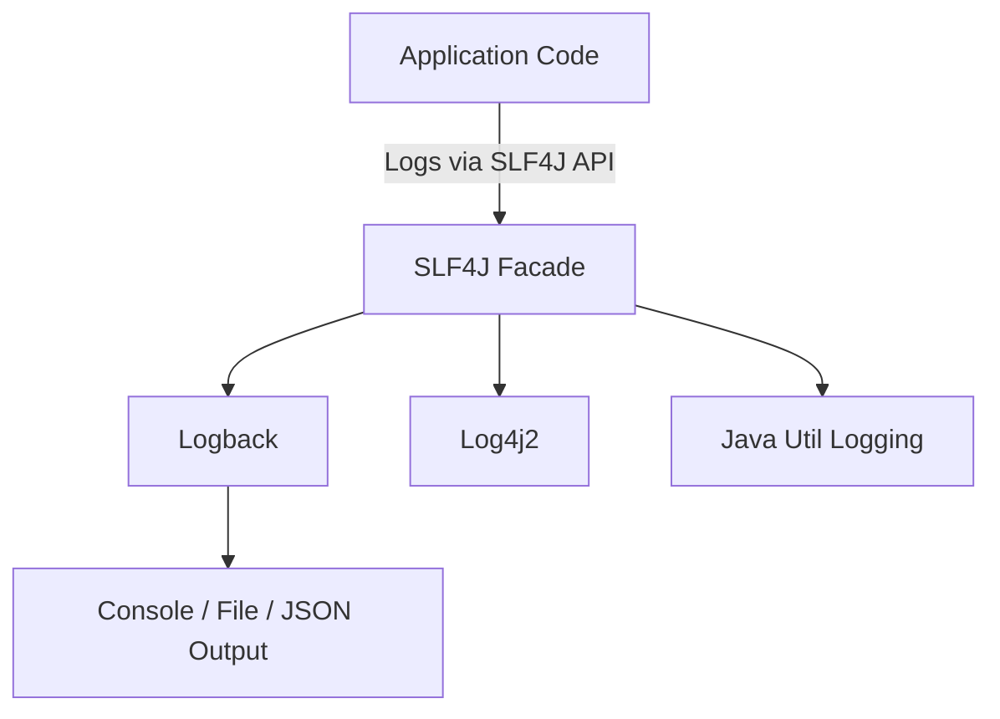

# 🚀 Logging in Spring Boot

Logging is a critical part of any Spring Boot application. It helps developers monitor application behavior, troubleshoot issues and understand the flow of execution.

Spring Boot uses **SLF4J (Simple Logging Facade for Java)** as a logging abstraction and **Logback** as the default logging implementation.

---

## 🏷️ Logging Architecture Overview



* **SLF4J:** Provides a common logging API used by Spring.
* **Logback:** The default logging framework in Spring Boot.
* **Log4j2 / JUL:** Can also be used by switching dependencies.

---

## 🏷️ Default Logging in Spring Boot

By default, Spring Boot logs messages to the **console** using `Logback` with a standard pattern.

Example default format:

```
2025-10-09T10:15:30.123+05:30  INFO 12345 --- [  main] c.v.s.MyApplication : Starting MyApplication
```

### 🔹 Logging Levels

Spring Boot supports multiple logging levels:

* **TRACE** → Most detailed
* **DEBUG** → Debug-level information
* **INFO** → General application flow (default)
* **WARN** → Potential issues
* **ERROR** → Failures
* **OFF** → Disable logging completely

---

## 🏷️ Configure Logging Levels in `application.yml`

You can configure the logging level for the entire app or specific packages.

```yaml
logging:
  pattern:
    #Set logging pattern for console and in file
    console: "%d{yyyy-MM-dd HH:mm:ss} %-5level %logger{36} - %msg%n"
    #    console: "%d{yyyy-MM-dd HH:mm:ss} %-5level - %msg%n"
    file: '%d{yyyy-MM-dd HH:mm:ss} [%thread] %-5level %logger{36} - %msg%n'
    #log file path and name configuration
  file:
    name: ./log/application.log
    #log file rolling configuration
  logback:
    rollingpolicy:
      max-history: 1
      max-file-size: 5KB
      file-name-pattern: ./log/application-%d{yyyy-MM-dd}.%i.log
      #The maximum amount of size log archives can take before being deleted.
      #total-size-cap: 10KB
  #Set logging level
  level:
    root: INFO
    com.vednexgen: DEBUG
```

### 🔹 Explanation:

# 🧩 Spring Boot Logging Configuration

This section explains how to configure **logging in Spring Boot** using `application.yml` with SLF4J and Logback.

---

## 🧱 Logging Configuration

```yaml
logging:
  pattern:
    # Set logging pattern for console and in file
    console: "%d{yyyy-MM-dd HH:mm:ss} %-5level %logger{36} - %msg%n"
    file: '%d{yyyy-MM-dd HH:mm:ss} [%thread] %-5level %logger{36} - %msg%n'

  file:
    name: ./log/application.log

  logback:
    rollingpolicy:
      max-history: 1
      max-file-size: 5KB
      file-name-pattern: ./log/application-%d{yyyy-MM-dd}.%i.log

  level:
    root: INFO
    com.vednexgen: DEBUG
```

---

### 🔹 logging.pattern

Defines **how log messages are formatted** in both console and file outputs.
You can customize the pattern using **conversion words** like `%d`, `%level`, `%logger`, `%msg`, etc.

### 🔹 Console Pattern

```yaml
console: "%d{yyyy-MM-dd HH:mm:ss} %-5level %logger{36} - %msg%n"
```

➡ Example output:

```
2025-10-09 10:15:22 INFO  com.vednexgen.controller.HomeController - Application started successfully
```

| Placeholder               | Meaning                       |
| ------------------------- | ----------------------------- |
| `%d{yyyy-MM-dd HH:mm:ss}` | Date/time of the log          |
| `%-5level`                | Log level (INFO, DEBUG, etc.) |
| `%logger{36}`             | Logger name (max 36 chars)    |
| `%msg`                    | Log message                   |
| `%n`                      | New line                      |

### 🔹 File Pattern

```yaml
file: '%d{yyyy-MM-dd HH:mm:ss} [%thread] %-5level %logger{36} - %msg%n'
```

➡ Example output:

```
2025-10-09 10:15:22 [main] INFO  com.vednexgen.controller.HomeController - Application started successfully
```

Includes `[thread]` name to help debug concurrency or multi-threading logs.

---

### 🔹 logging.file.name

```yaml
file:
  name: ./log/application.log
```

Defines the **path and name** of the log file.

➡ Example structure:

```
/your-project/
    └── log/
        └── application.log
```

---

### ♻️ logging.logback.rollingpolicy

Manages **log file rotation**, preventing files from growing indefinitely.

```yaml
logback:
  rollingpolicy:
    max-history: 1
    max-file-size: 5KB
    file-name-pattern: ./log/application-%d{yyyy-MM-dd}.%i.log
```

| Property            | Description                                                |
| ------------------- | ---------------------------------------------------------- |
| `max-history`       | Keeps logs for only 1 day. Older logs deleted.             |
| `max-file-size`     | Rolls over when file exceeds 5KB.                          |
| `file-name-pattern` | Defines naming for rolled logs. `%d` = date, `%i` = index. |

Example rolled files:

```
application-2025-10-09.0.log
application-2025-10-09.1.log
```

---

### 🔹 logging.level

Sets **log levels** globally or for specific packages.

```yaml
level:
  root: INFO
  com.vednexgen: DEBUG
```

| Logger          | Level   | Meaning                                         |
| --------------- | ------- | ----------------------------------------------- |
| `root`          | `INFO`  | Applies globally; shows INFO, WARN, ERROR logs. |
| `com.vednexgen` | `DEBUG` | Enables detailed DEBUG logs for your package.   |

✅ Useful to enable verbose logging for your classes while keeping Spring logs cleaner.

---

### ✨ Summary Table

| Section                         | Purpose                     |
| ------------------------------- | --------------------------- |
| `logging.pattern`               | Controls log message format |
| `logging.file.name`             | Defines log file location   |
| `logging.logback.rollingpolicy` | Handles log file rotation   |
| `logging.level`                 | Controls log verbosity      |

---

### 🔹 Bonus Tip

Add colors and app name to console logs:

```yaml
logging:
  pattern:
    console: "%d{yyyy-MM-dd HH:mm:ss} [%highlight(%-5level)] [%cyan(%logger{36})] - %msg
```

---

## 🏷️ Usage of SLF4J

### Step 1: Import Logger

```java
import org.slf4j.Logger;
import org.slf4j.LoggerFactory;
```

### Step 2: Create Logger Instance

```java
@RestController
public class EmployeeController {

    private static final Logger logger = LoggerFactory.getLogger(EmployeeController.class);

    @GetMapping("/employee")
    public String getEmployee() {
        logger.info("Fetching employee details...");
        logger.debug("Debug info for employee processing");
        return "Employee fetched successfully!";
    }
}
```

### Output:

```
2025-10-09 10:25:41 [http-nio-8080-exec-1] INFO  c.v.s.EmployeeController - Fetching employee details...
```

---

## 📌 Best Practices

* Use `logger.debug()` for development-level logs.
* Use `logger.info()` for business events.
* Use `logger.error()` for exception details.
* Avoid `System.out.println()` in production code.
* Centralize logging using **Spring Boot Actuator → /actuator/loggers** endpoint.

---

## ✨ Summary

| Concept              | Description                                 |
| -------------------- | ------------------------------------------- |
| **SLF4J**            | Logging abstraction used by Spring          |
| **Logback**          | Default logging framework                   |
| **Logging Levels**   | TRACE, DEBUG, INFO, WARN, ERROR             |
| **application.yml**  | Configure levels, patterns, and file output |
| **Actuator Loggers** | Change logging levels at runtime            |

---
