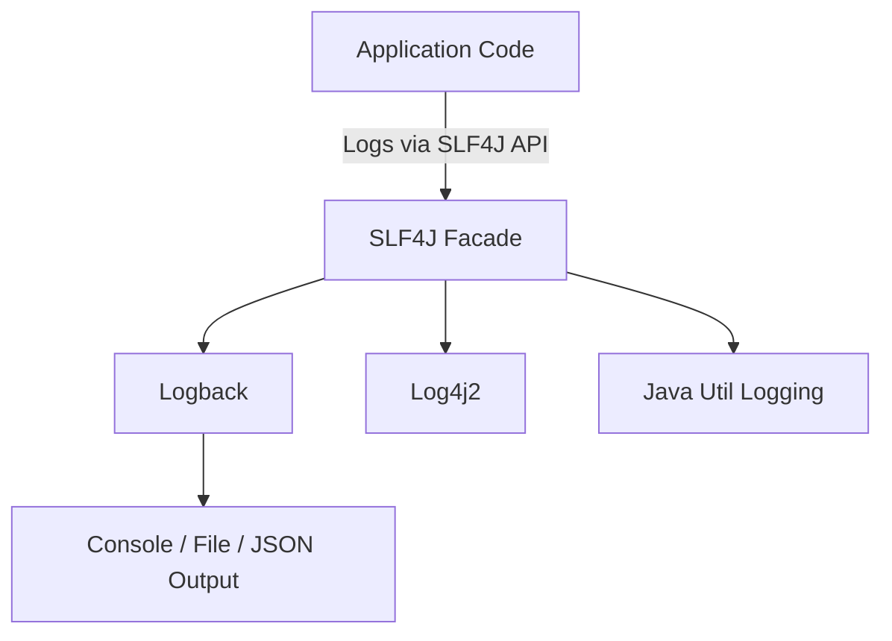

# 🚀 Logging in Spring Boot

Logging is a critical part of any Spring Boot application. It helps developers monitor application behavior, troubleshoot issues and understand the flow of execution.

Spring Boot uses **SLF4J (Simple Logging Facade for Java)** as a logging abstraction and **Logback** as the default logging implementation.

---

## 🧩 Logging Architecture Overview



* **SLF4J:** Provides a common logging API used by Spring.
* **Logback:** The default logging framework in Spring Boot.
* **Log4j2 / JUL:** Can also be used by switching dependencies.

---

## ⚙️ Default Logging in Spring Boot

By default, Spring Boot logs messages to the **console** using `Logback` with a standard pattern.

Example default format:

```
2025-10-09T10:15:30.123+05:30  INFO 12345 --- [  main] c.v.s.MyApplication : Starting MyApplication
```

### Logging Levels

Spring Boot supports multiple logging levels:

* **TRACE** → Most detailed
* **DEBUG** → Debug-level information
* **INFO** → General application flow (default)
* **WARN** → Potential issues
* **ERROR** → Failures
* **OFF** → Disable logging completely

---

## ⚙️ Configure Logging Levels in `application.yml`

You can configure the logging level for the entire app or specific packages.

```yaml
logging:
  level:
    root: INFO
    com.vednexgen: DEBUG
  pattern:
    console: "%d{yyyy-MM-dd HH:mm:ss} [%thread] %-5level %logger{36} - %msg%n"
  file:
    name: application.log
```

### Explanation:

* `root` → Default level for all logs.
* `com.vednexgen` → Custom level for your package.
* `pattern.console` → Defines log format.
* `file.name` → Saves logs to file `application.log`.

---

## 🧾 Example Usage of SLF4J

### Step 1: Import Logger

```java
import org.slf4j.Logger;
import org.slf4j.LoggerFactory;
```

### Step 2: Create Logger Instance

```java
@RestController
public class EmployeeController {

    private static final Logger logger = LoggerFactory.getLogger(EmployeeController.class);

    @GetMapping("/employee")
    public String getEmployee() {
        logger.info("Fetching employee details...");
        logger.debug("Debug info for employee processing");
        return "Employee fetched successfully!";
    }
}
```

### Output:

```
2025-10-09 10:25:41 [http-nio-8080-exec-1] INFO  c.v.s.EmployeeController - Fetching employee details...
```

---

## 🧠 Best Practices

* Use `logger.debug()` for development-level logs.
* Use `logger.info()` for business events.
* Use `logger.error()` for exception details.
* Avoid `System.out.println()` in production code.
* Centralize logging using **Spring Boot Actuator → /actuator/loggers** endpoint.

---

## 🔍 Demo: Custom Log Pattern & Levels

### `application.yml`

```yaml
logging:
  level:
    root: INFO
    com.vednexgen: DEBUG
  pattern:
    console: "%clr(%d{HH:mm:ss}){blue} %clr(%-5level){yellow} %clr(%logger{36}){cyan} - %msg%n"
```

### Output Example:

```
10:30:45 INFO  com.vednexgen.EmployeeController - Fetching employee details...
10:30:45 DEBUG com.vednexgen.EmployeeController - Debug info for employee processing
```

---

## 📈 Summary

| Concept              | Description                                 |
| -------------------- | ------------------------------------------- |
| **SLF4J**            | Logging abstraction used by Spring          |
| **Logback**          | Default logging framework                   |
| **Logging Levels**   | TRACE, DEBUG, INFO, WARN, ERROR             |
| **application.yml**  | Configure levels, patterns, and file output |
| **Actuator Loggers** | Change logging levels at runtime            |

---

✅ **Next Step:** Explore Spring Boot Actuator `/actuator/loggers` endpoint to dynamically change log levels at runtime.
