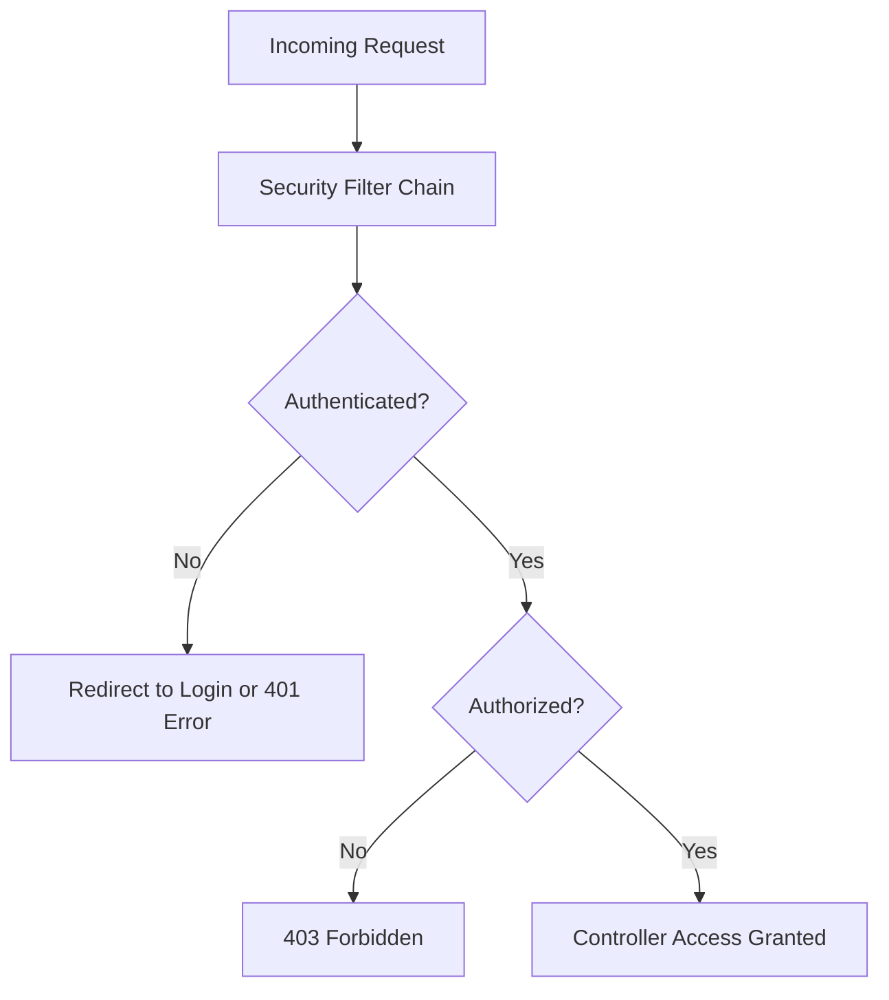

# 🚀 Spring Security: Authentication, Authorization, and Role-Based Access

## 📚 Overview

Spring Security is a powerful and customizable framework that provides authentication, authorization, and protection against common attacks (like CSRF, session fixation, etc.) for Spring-based applications.

It integrates seamlessly with Spring Boot through the **spring-boot-starter-security** dependency.

---

## 📚 Authentication vs Authorization

| Concept            | Description                                              | Example                      |
| ------------------ | -------------------------------------------------------- | ---------------------------- |
| **Authentication** | Verifying *who* the user is (identity).                  | Login with username/password |
| **Authorization**  | Checking *what* the user is allowed to do (permissions). | Only admins can delete users |

---

## 📚 Security Filter Chain

Spring Security uses a **filter chain** that intercepts every HTTP request before it reaches your controllers.

**Flow Diagram:**



---

## 🏷️ Basic Setup

> ✅ `Note:` For working sample refer [here](../src/main/java/com/vednexgen/security)

### 🔹 1. Add Dependency

```xml
<dependency>
    <groupId>org.springframework.boot</groupId>
    <artifactId>spring-boot-starter-security</artifactId>
</dependency>
```

### 🔹 2. Default Security Behavior

When added, Spring Boot automatically:

* Secures all endpoints by default.
* Creates a default user with a generated password (shown in logs).

Example log line:

```
Using generated security password: 6f3c8d3f-2a3a-48b2-b9f3-17b57d112345
```

You can log in with:

```
Username: user
Password: <value from log>
```

---

## 📚 Custom Security Configuration

### 🔹 Define Custom User Credentials and Security Rules

Create a configuration class:

```java
import org.springframework.context.annotation.Bean;
import org.springframework.security.config.annotation.method.configuration.EnableMethodSecurity;
import org.springframework.security.config.annotation.web.builders.HttpSecurity;
import org.springframework.security.web.SecurityFilterChain;

@Configuration
@EnableMethodSecurity
public class SecurityConfig {

    // ✅ Define multiple users
    @Bean
    public UserDetailsService userDetailsService() {
        UserDetails admin = User.withDefaultPasswordEncoder()
                .username("admin")
                .password("password123")
                .roles("ADMIN")
                .build();

        UserDetails user = User.withDefaultPasswordEncoder()
                .username("user")
                .password("password456")
                .roles("USER")
                .build();

        UserDetails manager = User.withDefaultPasswordEncoder()
                .username("manager")
                .password("password789")
                .roles("MANAGER")
                .build();

        return new InMemoryUserDetailsManager(admin, user, manager);
    }

    // ✅ Configure HTTP security
    @Bean
    public SecurityFilterChain securityFilterChain(HttpSecurity http) throws Exception {
        http
                .authorizeHttpRequests(auth -> auth
                        .requestMatchers("/admin/**").hasRole("ADMIN")
                        .requestMatchers("/manager/**").hasAnyRole("ADMIN", "MANAGER")
                        .requestMatchers("/user/**").hasAnyRole("USER", "ADMIN", "MANAGER")
                        .anyRequest().authenticated()
                        // 👇 Allow all other endpoints (publicly accessible)
                        .anyRequest().permitAll()
                ).httpBasic(Customizer.withDefaults()) ;  // enable basic authentication

        return http.build();
    }
}
```

---

#### Controller 

```java
import org.springframework.web.bind.annotation.GetMapping;
import org.springframework.web.bind.annotation.RequestMapping;
import org.springframework.web.bind.annotation.RestController;

@RestController
@RequestMapping("/api")
public class EmployeeController {

    @GetMapping("/public/info")
    public String publicInfo() {
        return "This is public information.";
    }

    @GetMapping("/user/profile")
    public String userProfile() {
        return "This is user profile page.";
    }

    @GetMapping("/admin/dashboard")
    public String adminDashboard() {
        return "Welcome Admin, to the dashboard.";
    }
}
```

---

## 📚 Role-Based Security Using Annotations

You can also secure specific methods using annotations:

```java
@RestController
@RequestMapping("/api/secure")
public class SecureController {

    @PreAuthorize("hasRole('ADMIN')")
    @GetMapping("/admin")
    public String adminOnly() {
        return "Only admins can access this endpoint.";
    }

    @PreAuthorize("hasAnyRole('USER', 'ADMIN')")
    @GetMapping("/user")
    public String userOrAdminAccess() {
        return "User or Admin can access this endpoint.";
    }
}
```

---

## ✨ Summary

* **Authentication** confirms identity.
* **Authorization** grants permissions.
* **Spring Boot Starter Security** simplifies integration.
* Use **`@PreAuthorize`** or **securityFilterChain** rules for granular control.

---
