```mermaid
graph TD
A["UserService.addUser()"] --> B["AOP Intercepts"]
B --> C["@Before Advice → executes"]
C --> D["Actual method executes"]
D --> E["@After Advice → executes"]
```

# 🚀 AOP (Aspect-Oriented Programming) in Spring Boot

## 📚 Introduction

**Aspect-Oriented Programming (AOP)** is a programming paradigm that allows developers to separate **cross-cutting concerns** from the main business logic of the application.

In simple terms, AOP helps you **add common functionalities** (like logging, security, or transactions) across multiple methods **without duplicating code**.

---

### 🏷️ What are Cross-Cutting Concerns?

Cross-cutting concerns are parts of a program that affect multiple layers or components but don’t belong to the core business logic.

| Example            | Description                                 |
| ------------------ | ------------------------------------------- |
| Logging            | Track method execution, performance, errors |
| Security           | Check permissions before executing methods  |
| Transactions       | Manage database transactions                |
| Caching            | Store frequently accessed data              |
| Exception Handling | Centralized error handling                  |

---

### 🏷️ AOP Terminology

| Term           | Description                                                                     |
| -------------- | ------------------------------------------------------------------------------- |
| **Aspect**     | A class that contains cross-cutting logic (e.g., logging aspect).               |
| **Join Point** | A point in application flow where you can apply an aspect (like a method call). |
| **Advice**     | The actual action taken by an aspect (e.g., code to log info).                  |
| **Pointcut**   | Expression that selects join points (e.g., all methods in a package).           |
| **Weaving**    | Process of applying aspects to target objects.                                  |

---

### 🏷️️ AOP Annotations in Spring

| Annotation        | Description                                             |
| ----------------- | ------------------------------------------------------- |
| `@Aspect`         | Marks a class as an Aspect.                             |
| `@Before`         | Runs advice before the target method.                   |
| `@After`          | Runs advice after the target method finishes.           |
| `@AfterReturning` | Runs advice after method successfully returns a result. |
| `@AfterThrowing`  | Runs advice after method throws an exception.           |
| `@Around`         | Runs advice before and after a method (most powerful).  |

---

## 📚 Program: Log Method Calls using AOP

> ✅ `Note:` For working sample refer [here](../src/main/java/com/vednexgen/aop)

### Step 1️⃣ — Add Dependency

If using Maven, include the AOP starter in `pom.xml`:

```xml
<dependency>
    <groupId>org.springframework.boot</groupId>
    <artifactId>spring-boot-starter-aop</artifactId>
</dependency>
```

---

### Step 2️⃣ — Create a Simple Service

```java
package com.vednexgen.aop.service;

import org.springframework.stereotype.Service;

@Service
public class UserService {

    public void addUser(String name) {
        IO.println("User added: " + name);
    }

    public String getUser() {
        IO.println("Fetching user details...");
        return "Atrangi";
    }

    public void throwError() {
        IO.println("This will throw exception");
        throw new RuntimeException("Something went wrong!");
    }
}
```

---

### Step 3️⃣ — Create a Logging Aspect

```java
package com.vednexgen.aop.aspect;

import org.aspectj.lang.JoinPoint;
import org.aspectj.lang.ProceedingJoinPoint;
import org.aspectj.lang.annotation.*;
import org.springframework.stereotype.Component;

@Aspect
@Component
public class LoggingAspect {

    @Before("execution(* com.vednexgen.aop.service.*.*(..))")
    public void logBefore(JoinPoint joinPoint) {
        IO.println("Before Method: " + joinPoint.getSignature().getName());
    }

    @After("execution(* com.vednexgen.aop.service.*.*(..))")
    public void logAfter(JoinPoint joinPoint) {
        IO.println("After Method: " + joinPoint.getSignature().getName());
    }

    @AfterReturning(pointcut = "execution(* com.vednexgen.aop.service.*.*(..))", returning = "result")
    public void logAfterReturning(JoinPoint joinPoint, Object result) {
        IO.println("After Returning from Method: " + joinPoint.getSignature().getName());
        IO.println("Returned Value: " + result);
    }

    @AfterThrowing(pointcut = "execution(* com.vednexgen.aop.service.*.*(..))", throwing = "ex")
    public void logAfterThrowing(JoinPoint joinPoint, Exception ex) {
        IO.println("Exception in Method: " + joinPoint.getSignature().getName());
        IO.println("Exception Message: " + ex.getMessage());
    }

    @Around("execution(* com.vednexgen.aop.service.*.*(..))")
    public Object logAround(ProceedingJoinPoint joinPoint) throws Throwable {
        long start = System.currentTimeMillis();
        IO.println("Around Before: " + joinPoint.getSignature().getName());

        Object result = null;
        try {
            result = joinPoint.proceed();
        } finally {
            long elapsedTime = System.currentTimeMillis() - start;
            IO.println("Around After: " + joinPoint.getSignature().getName() + " took " + elapsedTime + "ms");
        }
        return result;
    }
}
```

---

### Step 4️⃣ — Run and Observe Output

```java
package com.vednexgen;

import com.vednexgen.aop.service.UserService;
import org.springframework.boot.CommandLineRunner;
import org.springframework.boot.SpringApplication;
import org.springframework.boot.autoconfigure.SpringBootApplication;
import org.springframework.context.annotation.Bean;

@SpringBootApplication
public class DemoApplication {

    public static void main(String[] args) {
        SpringApplication.run(DemoApplication.class, args);
    }

    @Bean
    CommandLineRunner runner(UserService userService) {
        return args -> {
            userService.addUser("Atrangi");
            userService.getUser();
            try {
                userService.throwError();
            } catch (Exception ignored) {}
        };
    }
}
```

**Output:**

```
Around Before: addUser
Before Method: addUser
User added: Atrangi
After Method: addUser
After Returning from Method: addUser
Returned Value: null
Around After: addUser took 1ms

Around Before: getUser
Before Method: getUser
Fetching user details...
After Method: getUser
After Returning from Method: getUser
Returned Value: Atrangi
Around After: getUser took 0ms

Around Before: throwError
Before Method: throwError
This will throw exception
After Method: throwError
Exception in Method: throwError
Exception Message: Something went wrong!
Around After: throwError took 0ms
```

---

## ♻️ Understanding the Flow

---


---

## 📌 Key Notes

* Use **`@Around`** advice for performance monitoring or transaction control.
* Define **reusable pointcuts** using `@Pointcut` annotation.
* You can target specific classes or packages using expressions like:

```java
@Before("execution(* com.vednexgen.aop.controller.*.*(..))"
```
* Use logging frameworks like **SLF4J/Logback** instead of `IO.println()` in real projects.

---

## ✨ Summary

| Concept          | Description                                                         |
| ---------------- | ------------------------------------------------------------------- |
| **AOP**          | Separates cross-cutting concerns from business logic                |
| **Aspect**       | Class that defines cross-cutting logic                              |
| **Advice Types** | `@Before`, `@After`, `@AfterReturning`, `@AfterThrowing`, `@Around` |
| **Use Case**     | Logging, security, transactions, monitoring                         |

---
