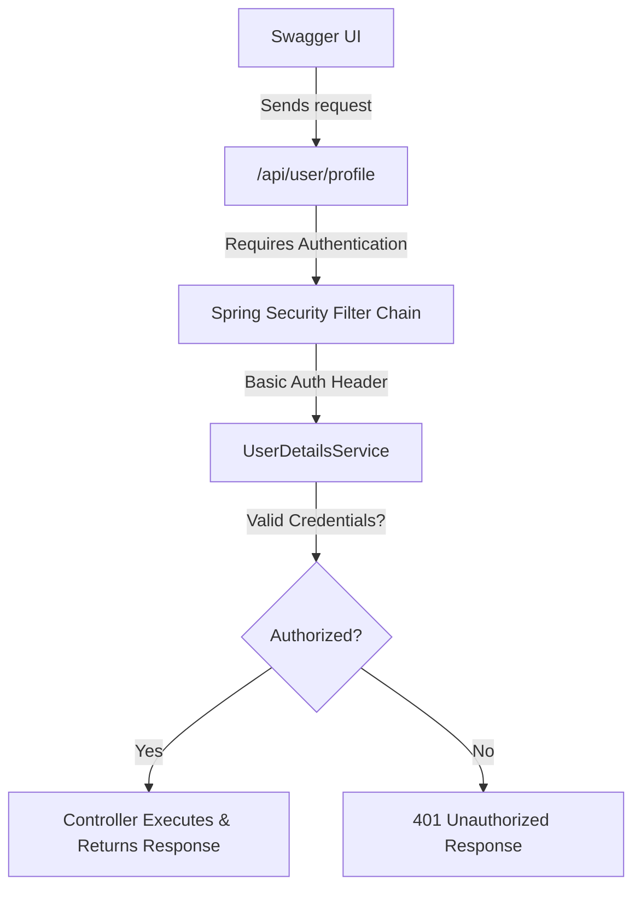

# 🚀 REST API Security Integration with Swagger (OpenAPI)

## 📚 Overview

When you enable Spring Security, some endpoints become secured — requiring authentication (Basic Auth, Bearer Token, etc.).
By default, Swagger UI won’t know how to authenticate with those endpoints.
To make Swagger UI capable of testing protected endpoints, you must explicitly configure security schemes in OpenAPI.

### 🏷️ Understanding Swagger Security Integration

| Concept              | Description                                                              |
| -------------------- | ------------------------------------------------------------------------ |
| @SecurityScheme      | Defines how your API secures endpoints (e.g., Basic Auth, Bearer Token). |
| @SecurityRequirement | Tells Swagger which endpoints need authentication.                       |
| @OpenAPIDefinition   | Provides global API metadata (title, version, etc.).                     |

Swagger UI uses this metadata to display an “Authorize” button, allowing users to input credentials for secured endpoints.

### 🏷️ Define a Basic Authentication Scheme

You must define a `@SecurityScheme` once in your application, so Swagger knows what type of security is used.

You can put it in either:
* a dedicated configuration class, or
* your main application class.

> ✅ `Note:` For working sample refer SwaggerConfigs.java file [here](../src/main/java/com/vednexgen/config)

#### Option 1 — Configuration Class (Recommended)

```java
package com.vednexgen.config;

import io.swagger.v3.oas.annotations.OpenAPIDefinition;
import io.swagger.v3.oas.annotations.enums.SecuritySchemeType;
import io.swagger.v3.oas.annotations.info.Info;
import io.swagger.v3.oas.annotations.security.SecurityScheme;
import org.springframework.context.annotation.Configuration;

@Configuration
@OpenAPIDefinition(
        info = @Info(
                title = "Spring Boot Course API",
                version = "1.0",
                description = "API documentation for Spring Boot Course API"
        )
)
@SecurityScheme(
        name = "basicAuth",
        type = SecuritySchemeType.HTTP,
        scheme = "basic"
)
public class SwaggerConfigs {
}

```

#### Option 2 — Add to Main Application Class

```java
@SpringBootApplication(scanBasePackages = {"com.vednexgen"})
@OpenAPIDefinition(
        info = @Info(
                title = "Spring Boot Course API",
                version = "1.0",
                description = "API documentation for Spring Boot Course API"
        )
)
@SecurityScheme(
        name = "basicAuth",
        type = SecuritySchemeType.HTTP,
        scheme = "basic"
)
public class SpringBootCourseApplication {
    public static void main(String[] args) {
        SpringApplication.run(SpringBootCourseApplication.class, args);
    }
}
```

### 🏷️ Annotate Specific Endpoints

To protect only certain endpoints, add `@SecurityRequirement` to those controllers or methods.

```java
@RestController
@RequestMapping("/api/user")
public class UserController {

    @GetMapping("/profile")
    @SecurityRequirement(name = "basicAuth")
    public String userProfile() {
        return "This is user profile page.";
    }

    @GetMapping("/public")
    public String publicEndpoint() {
        return "This is a public endpoint.";
    }
}
```

✅ Now Swagger will:

* Show 🔒 lock icon for `/api/user/profile`
* Keep `/api/user/public` open

--- 

### 🏷️ Test in Swagger UI

* Run your Spring Boot application.
* Visit `http://localhost:8080/swagger-ui.html`.
* Click Authorize 🔒 button in the top-right corner.
* Select the `basicAuth` scheme and provide:

    * Username: `user`
    * Password: `password`

Now, you can successfully call `/api/user/profile` from Swagger!

---

### 🏷️ Visual Flow Diagram


---

### 🏷️ Expected Swagger UI Behavior

| Endpoint          | Auth Required | Swagger Lock | Description            |
| ----------------- | ------------- | ------------ | ---------------------- |
| /api/user/profile | ✅ Yes         | 🔒           | Secured via Basic Auth |
| /api/user/public  | ❌ No          | –            | Publicly accessible    |
| /api-docs         | ❌ No          | –            | Swagger JSON spec      |
| /swagger-ui.html  | ❌ No          | –            | Swagger UI page        |

---

## 💡 Common Issues

| Issue                        | Reason                               | Fix                                                               |
| ---------------------------- | ------------------------------------ | ----------------------------------------------------------------- |
| 401 Unauthorized in Swagger  | Not authorized in Swagger UI         | Click “Authorize” and provide valid credentials                   |
| /swagger-ui.html not loading | Security blocked the endpoint        | Permit `/swagger-ui/**` and `/api-docs/**` in SecurityFilterChain |
| Lock icon not showing        | Missing `@SecurityScheme` definition | Add `@SecurityScheme` annotation                                  |
| Want all endpoints secured   | Apply globally                       | Add `@SecurityRequirement` at `@OpenAPIDefinition` level          |

---
<div>

[](17-SWAGGER_DOCUMENTATION.md)
&emsp;&emsp;
[](19-SPRING_DEVTOOLS.md)

</div>

[](00-TABLE_CONTENT_README.md)

---