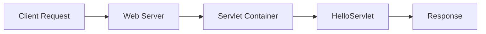
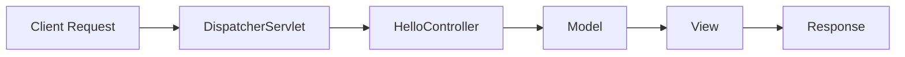
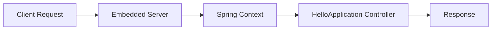
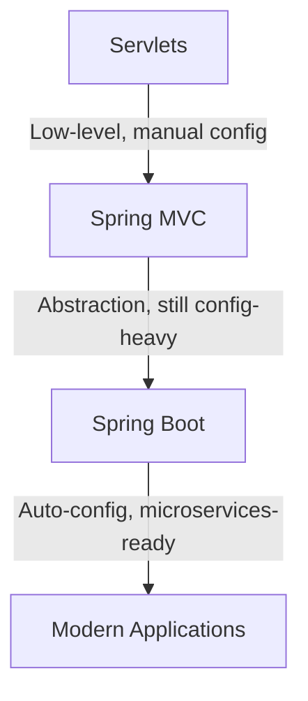

# 🚀 Introduction to Spring Boot

---

## 🍃 What is Spring Boot?

* A framework built on top of **Spring Framework**
* It provides an **opinionated approach** to development:
    * Chooses sensible defaults for you.
    * Reduces the need for manual configuration.
* Designed to **simplify development** of Spring applications
* Allows you to create **standalone, production-ready applications**.
* Its goal: *"Just run your application with minimal setup."*
---

## ⚙️ Traditional Approach (Servlets & Spring MVC)

### 📚 Evolution of Spring Boot 

> From Servlets → Spring MVC → Spring Boot

### 🏷️ Servlets (Early Days)

* Low-level API for handling HTTP requests & responses
* Requires lots of **boilerplate code**
* Hard to scale for complex applications

**Example Servlet Code (Java + web.xml)**

```xml
<!-- web.xml -->
<web-app>
    <servlet>
        <servlet-name>HelloServlet</servlet-name>
        <servlet-class>com.example.HelloServlet</servlet-class>
    </servlet>
    <servlet-mapping>
        <servlet-name>HelloServlet</servlet-name>
        <url-pattern>/hello</url-pattern>
    </servlet-mapping>
</web-app>
```

```java
// HelloServlet.java
import java.io.*;
import javax.servlet.*;
import javax.servlet.http.*;

public class HelloServlet extends HttpServlet {
    protected void doGet(HttpServletRequest request, HttpServletResponse response)
            throws ServletException, IOException {
        response.setContentType("text/html");
        PrintWriter out = response.getWriter();
        out.println("<h1>Hello from Servlet!</h1>");
    }
}
```

---

#### 🔹 Flowchart / Diagram



---

### 🏷️ Spring MVC (Improved)

* Built on top of Servlets. Thus, improved abstraction over Servlets.
* * Introduces **DispatcherServlet** that acts as the **front controller**.
* Provides **Model-View-Controller** architecture.
* Provides **annotations** like `@Controller`, `@RequestMapping` for request handling.
* Reduces boilerplate as compare to Servlets.
* **Problem**: Still required XML or Java-based bean configuration, ViewResolvers, DataSources.

**Example Spring MVC Code**

```java
// HelloController.java
import org.springframework.stereotype.Controller;
import org.springframework.web.bind.annotation.RequestMapping;
import org.springframework.web.bind.annotation.ResponseBody;

@Controller
public class HelloController {
    @RequestMapping("/hello")
    @ResponseBody
    public String sayHello() {
        return "Hello from Spring MVC!";
    }
}
```

```xml
<!-- web.xml -->
<web-app>
    <servlet>
        <servlet-name>dispatcher</servlet-name>
        <servlet-class>
            org.springframework.web.servlet.DispatcherServlet
        </servlet-class>
        <load-on-startup>1</load-on-startup>
    </servlet>

    <servlet-mapping>
        <servlet-name>dispatcher</servlet-name>
        <url-pattern>/</url-pattern>
    </servlet-mapping>
</web-app>

<!-- spring-servlet.xml -->
<beans xmlns="http://www.springframework.org/schema/beans"
       xmlns:xsi="http://www.w3.org/2001/XMLSchema-instance"
       xsi:schemaLocation="http://www.springframework.org/schema/beans http://www.springframework.org/schema/beans/spring-beans.xsd">

    <context:component-scan base-package="com.example" />
    <mvc:annotation-driven />
</beans>
```

---

#### 🔹 Flowchart / Diagram



---

### 🏷️ Spring Boot (Modern Approach)

* Built on top of Spring Framework, designed to **remove configuration pain**.
* Provides **auto-configuration**, **embedded servers**, and **starter dependencies**.
* No `web.xml`, no manual DispatcherServlet setup — everything auto-configured.
* Eliminates boilerplate configuration.
* Built-in **embedded server** (Tomcat, Jetty).
* **Auto-configuration** reduces manual setup.

**Example Spring Boot Code**

```java
// DemoApplication.java
import org.springframework.boot.SpringApplication;
import org.springframework.boot.autoconfigure.SpringBootApplication;
import org.springframework.web.bind.annotation.*;

@SpringBootApplication
@RestController
public class DemoApplication {
    @GetMapping("/hello")
    public String hello() {
        return "Hello from Spring Boot!";
    }

    public static void main(String[] args) {
        SpringApplication.run(DemoApplication.class, args);
    }
}
```

---

#### 🔹 Flowchart / Diagram



---

👉 Run application with:

```
# Using maven 
mvn spring-boot:run
```

```
# Using java
java -jar app.jar
```

---

## 🔄 Evolution: Servlets → Spring MVC → Spring Boot



* **Servlets** → Provided basic request/response handling but were verbose.
* **Spring MVC** → Added structure (MVC pattern), reusable components, easier request handling.
* **Spring Boot** → Removed the pain of XML & config, embedded servers, production-ready features.

---

## 🏠 Real-World Analogy

* **Servlets → Raw Materials**: Like building a house brick by brick. You need to arrange cement, bricks, plumbing, electricity, etc. (lots of manual effort).
* **Spring MVC → Semi-Constructed House**: You get a structure with walls and roof, but still need to do interiors, wiring, plumbing yourself.
* **Spring Boot → Fully Furnished House**: Ready to move in. Everything is already in place. You just bring your furniture and live (focus on business logic).

---

## ✅ Advantages of Spring Boot over Spring MVC & Servlets

1. **Faster Development**

    * No XML configuration, minimal annotations
    * Auto-configured components

2. **Embedded Servers**

    * No need to deploy WAR files to external servers
    * Run as simple `java -jar app.jar`

3. **Microservices Friendly**

    * Lightweight, easy to build REST APIs
    * Cloud-native support

4. **Production-Ready Tools**

    * Actuator, Logging, Metrics, Health monitoring
    * Actuator endpoints for monitoring.

5. **Developer Productivity**

    * Spring Boot Starter dependencies
    * Rapid prototyping with Spring Initializr

---

### 🔄 Comparison Table

| Feature                 |         Servlets          |        Spring MVC        |      Spring Boot      |
|:------------------------|:-------------------------:|:------------------------:|:---------------------:|
| Configuration           |    Manual (`web.xml`)     |      XML/Java-based      |    Auto-configured    |
| Server Setup            | Requires external server  | Requires external server | Embedded Tomcat/Jetty |
| Development Speed       |   Slow (low-level API)    | Moderate (manual config) |  Fast (ready-to-use)  |
| Microservices Support   |           ❌ No           |   ⚠️ Limited             |     ✅ Excellent      |
| Production Monitoring   |           ❌ No           |           ❌ No          |      ✅ Actuator      |

---

## ✨ Summary

* **Servlets** → Low-level, verbose
* **Spring MVC** → Structured but still config-heavy
* **Spring Boot** → Simplified, auto-configured, production-ready

👉 Spring Boot is the **modern standard** for building Java applications.

---

[](./TABLE_CONTENT_README.md)
