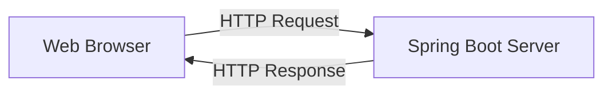

# 🚀 The Fundamentals of Web Applications & HTTP

## 📚 What is a Web Application?
A web application is software accessed through a browser and runs on a server. It consists of:
- **Client:** The user’s browser (e.g., Chrome, Firefox).
- **Server:** The backend application (e.g., Spring Boot) running on a computer (local or remote).
- **Network:** The medium (Internet/intranet) connecting client and server.

### 🏷️ The Client-Server Model
- **Client:** Sends requests (e.g., opening a web page, submitting a form).
- **Server:** Receives requests, processes them, and sends responses (e.g., HTML, JSON, images).

### 🏷️ How the Web Works (Step-by-Step)
1. **User enters a URL** (e.g., `https://example.com/hello`) in the browser.
2. **Browser constructs an HTTP request** and sends it to the server.
3. **Server receives the request, processes it** (may interact with databases or files).
4. **Server sends an HTTP response** back to the browser.
5. **Browser renders** the response (e.g., displays a web page or shows JSON data).

## 📚 HTTP Protocol: The Backbone of Web Communication

### 🏷️ What is HTTP?
**HTTP (Hypertext Transfer Protocol)** is the standard protocol for transferring web data. It is:
- **Stateless:** Each request is independent; the server does not remember previous requests.
- **Text-based:** Easy to read and debug.
- **Request-Response:** Communication always starts with the client sending a request and the server sending a response.

### 🏷️ Anatomy of HTTP Requests & Responses

#### HTTP Request Example
```
GET /hello HTTP/1.1
Host: localhost:8080
User-Agent: Mozilla/5.0
Accept: */*
```
- **Method:** `GET` (type of action)
- **Path:** `/hello` (resource being accessed)
- **Headers:** Metadata (browser type, accepted formats)
- **Body:** Optional, for methods like POST/PUT

#### HTTP Response Example
```
HTTP/1.1 200 OK
Content-Type: text/plain

Hello, World!
```
- **Status Line:** Protocol and status code (`200 OK`)
- **Headers:** Metadata about the response (`Content-Type`)
- **Body:** The actual data (HTML, JSON, plain text)

---

### 🏷️ Common HTTP Features

#### HTTP Methods (Verbs)
| Method | Description    | Typical Use          |
|--------|----------------|---------------------|
| GET    | Retrieve data  | Viewing a page      |
| POST   | Send data      | Submitting a form   |
| PUT    | Update data    | Editing a resource  |
| DELETE | Remove data    | Deleting a resource |

#### HTTP Status Codes
| Code | Meaning               |
|------|-----------------------|
| 200  | OK (Success)          |
| 201  | Created (POST Success)|
| 400  | Bad Request           |
| 404  | Not Found             |
| 500  | Internal Server Error |

#### Headers
- Used for extra information (e.g., authentication, content type, cookies).
- Examples: `Authorization`, `Content-Type`, `Set-Cookie`, `Accept`

#### Statelessness and Sessions
- **Stateless:** Each HTTP request is independent.
- **Sessions:** Servers can use cookies/tokens to track users across requests for login, shopping carts, etc.

#### Secure HTTP (HTTPS)
- Uses SSL/TLS for encryption.
- Ensures data privacy and integrity between client and server.

---

## 📚 Spring Boot HTTP Endpoints

### 🏷️ GET Endpoint

```java
@RestController
public class HelloController {
    @GetMapping("/hello")
    public String sayHello() {
        return "Hello, World!";
    }
}
```
**How it works:**  
When you visit `http://localhost:8080/hello`, your browser sends a GET request. The server responds with "Hello, World!".

### 🏷️ POST Endpoint

```java
@RestController
public class EchoController {
    @PostMapping("/echo")
    public String echoMessage(@RequestBody String message) {
        return "You said: " + message;
    }
}
```
**How it works:**  
A POST request with a message in the body will be echoed back in the response.

### 🏷️ Visualizing Web Communication



Web browser sends a request, server processes and responds, browser displays the result.

---

## 📚 Real-World: Visiting a Website

1. **Type URL:** `https://www.example.com`
2. **DNS Lookup:** Browser finds the IP address of the server.
3. **TCP Connection:** Browser connects to server over the network.
4. **Send HTTP Request:** Browser requests the home page.
5. **Server Processes Request:** Finds the correct resource or runs backend logic.
6. **Send HTTP Response:** Server sends HTML, browser renders it.

## ✨ Summary

- Web applications use HTTP to communicate between browsers and servers.
- HTTP is stateless, simple, and forms the basis of REST APIs.
- Spring Boot makes it easy to create endpoints that respond to HTTP requests.

---

[](./TABLE_CONTENT_README.md)

